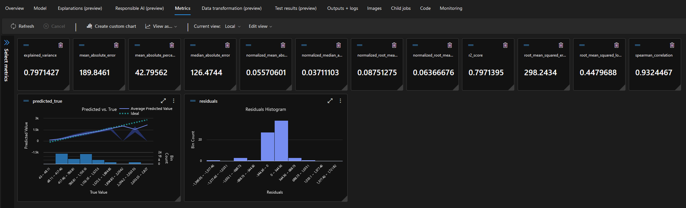
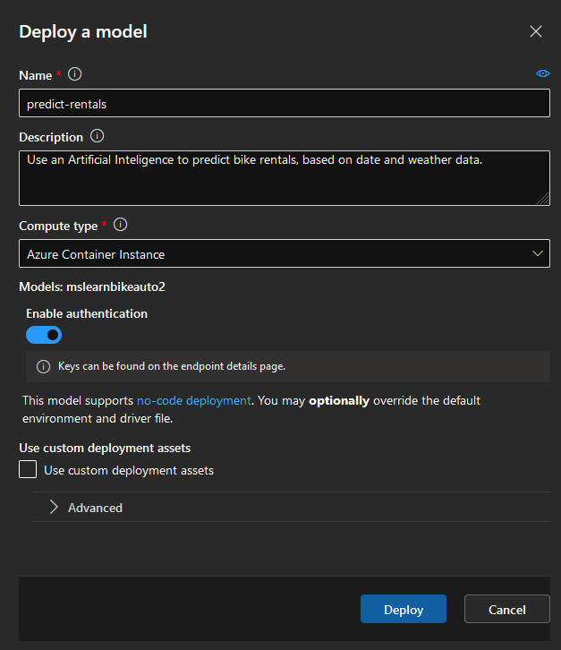
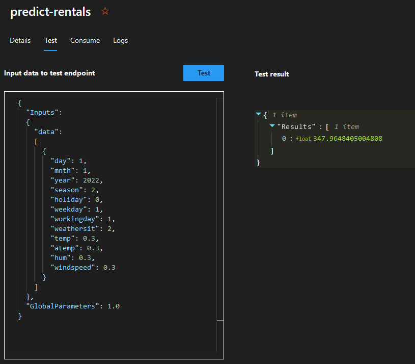
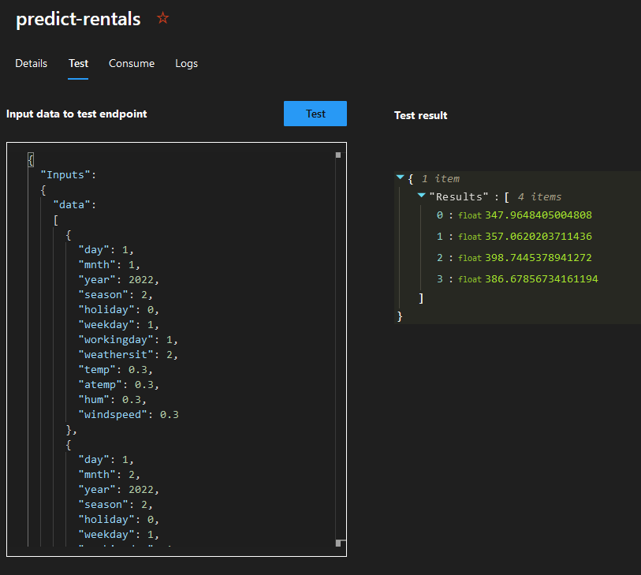
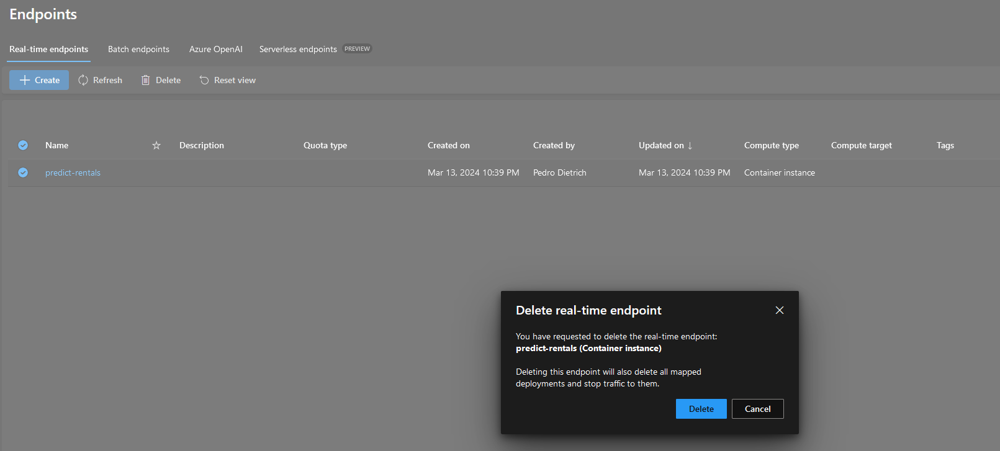

# Tutorial para Treinamento e Uso de Inteligência Artificial de Regressão do Azure

Este tutorial descreve o passo-a-passo para utilizar a plataforma de *Machine Learning* do Microsoft Azure para treinar uma Inteligência Artificial (IA) com dados e então utilizá-las para fazer previsões numéricas baseadas nos dados de treinamento (Regressão).

A IA será treinada para prever o número de aluguéis de bicicletas em um determinado dia, dadas informações como data e condições atmosféricas.

## Treinando o Modelo de Inteligência Artificial

1. Acesse o [Portal de *Machine Learning* do Azure](https://ml.azure.com) com login realizado, e crie um *workspace* para o **Azure Machine Learning** se necessário, especificando um nome e o *resource group*, podendo deixar as outras configurações com as opções padrões.

2. Dentro do *workspace*, acesse a seção `Automated ML` e crie um novo trabalho de aprendizado de máquina automatizado, clicando no botão `New Automated ML job`.

3. Preencha os campos requisitados para a criação do trabalho. A lista abaixo contém as configurações utilizadas neste tutorial. Configurações não citadas foram deixadas com os valores padrão.

- **Job name:** mslearn-bike-automl
- **New experiment name:** mslearn-bike-automl
  - Clique em `Next`.
- **Select task type:** Regression
  - Clique em `Create`.
    - **Name:** bike_rental
    - **Type:** Tabular
      - Clique em `Next`.
    - **Choose a source for your data asset:** From web files
      - Clique em `Next`.
    - **Web URL:** `https://aka.ms/bike-rentals`
      - Clique em `Next`.
    - **Column headers:** Only first file has headers
      - Clique em `Next`.
      - Clique em `Next`.
      - Clique em `Create`.
  - Espere até que os dados sejam validadados e clique em `Next`.
- **Target column:** rentals (Integer)
  - Clique em `View additional configuration settings`.
    - **Explain best model:** Unchecked
    - **Use all supported materials:** Unchecked
    - **Allowed models:** RandomForest, LightGBM
      - Clique em `Save`.
  - Expanda a seção `Limits`.
- **Max trials:** 3
- **Max concurrent trials:** 3
- **Max nodes:** 3
- **Metric score threshold:** 0.085
- **Experiment timeout (minutes):** 15
- **Iteration timeout (minutes):** 15
- **Enable early termination:** Checked
- **Validation type:** Train-validation split
- **Percentage validation of data:** 10
  - Clique em `Next`.
  - Clique em `Next`.
  - Clique em `Submit training job`.

Com isso, as configurações de treinamento da IA foram decididas e o serviço da Azure começará a validar e a treinar a IA com os dados presentes na URL especificada. O processo que pode levar alguns minutos.

## Utilizando a IA Treinada

4. Ainda dentro do mesmo *workspace*, acesse a seção `Jobs`, e clique no experimento `mslearn-bike-rental` que fora criado. Uma lista de tarefas deve aparecer, contendo uma tarefa homônima ao experimento; clique nela.

5. Dentro da região `Best model summary`, clique no nome do algoritmo (link abaixo de `Algorithm name`). No caso deste tutorial, o algoritmo se chama `VotingEnsemble`.

- **Opcional:** Verifique como o treinamento do modelo performou, acessando a aba `Metrics`. É possível revisar os gráficos e vários dados estatísticos da IA treinada.

6. Acesse a aba `Model` e clique em `Deploy`, selecionando a opção `Web service`. Isso criará um *endpoint* (ponto de extremidade) pelo qual a inteligência artificial poderá ser utilizada.

- **Name:** predict-rentals
- **Compute type:** Azure Container Instance
- **Enable authentication:** Habilitado
  - Clique em `Deploy`.

7. Acesse a seção `Endpoints` do *workspace* atual e clique no *endpoint* criado (neste caso `predict-rentals`). Espere a o *endpoint* ficar com o estado `Healthy` em `Deployment state` e `Succeded` em `Operation state`. Essa operação pode levar alguns minutos.

8. Acesse a aba `Test`. No editor de texto disponibilizado, é possível inserir JSONs com dados de entrada para que a IA possa prever a quantidade de aluguéis. Copie e cole os arquivos JSON com os dados de entrada (disponibilizados no diretório JSON deste repositório) e clique no botão `Test`. Veja o resultado do teste no quadro ao lado. Os arquivos JSON gerados pela IA também estão presentes neste repositório, sob o diretório JSON.

## Limpando os recursos Azure utilizados

Com o teste com IA concluído, resta deletar o *endpoint* utilizado, já que este se utiliza de um serviço da Azure. **O serviço não é gratuito, sendo necessário pagar uma taxa pelo tempo de utilização do recurso.**

9. Novamente, acesse a seção `Endpoints` do *workspace* e selecione o *endpoint* utilizado. Clique em `Delete` e depois confirme a deleção.

## Conclusão

Com isso o tutorial de treinamento e uso de IA no *Microsoft Azure* está completo. Embora neste tutorial a IA tenha sido treinada para prever aluguéis de bicicletas para um determinado dia, a mesma tutorial e a lógica por trás se aplica para qualquer modelo que utiliza regressão para determinar um valor a partir de vários parâmetros.

Utilizando outros serviços da Microsoft, é possível ser ainda mais abrangente e utilizar outros métodos além de regressão, como classificação, processamento de linguagem natural, entre outros.

Este tutorial deve servir como ponto de partida para se acostumar com o *Microsoft Azure AI* antes de seguir com tarefas mais complexas no ambiente.
